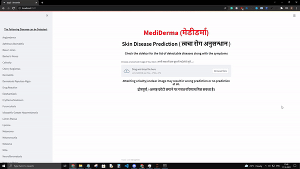

# MediDerma

## Overview
Mediclada is a web app for predicting skin diseases particularly to help rural citizens of India who have  
limited access to Healthcare Services. For now it can predict upto 29 most commonly occuring skin diseases in rural India.  
Built with simplicity in mind, Mediclada uses resnet34 with the fast.ai library and is trained for 65 epochs on a custom image  
dataset of 29 different classes. The model has an amazing accuracy of 98% and has been deployed using Streamlit.

Link to the custom(self-made) dataset : https://www.dropbox.com/s/agi9xn4vvokvkak/Dataset.zip?dl=0  \
Link to the Trained weights file : https://www.dropbox.com/s/dztcmi4x82m0xq1/export.pkl?dl=0

## Language
The whole project is written in Python3

## Dependencies 
Fast.ai (version : 1.0.61 ) \
Numpy ( version : 1.18.5 ) \
Pytorch (version : 1.4.0 ) \
Pickle (version : 4.0 ) \
Streamlit (version 0.69.1) 

## Installation and Usage

To run the whole training process, first install all the dependencies and my custom dataset (https://www.dropbox.com/s/m8t8w3kpeq7urm6/Dataset.zip?dl=0). 
Mention the path of the dataset in the `path = Path('C:/Dataset')` cell and run all the remaining cells to complete the training. Don't forget to save the model in the end. 

You can directly download the weights from this link (https://www.dropbox.com/s/dztcmi4x82m0xq1/export.pkl?dl=0) and run the code for \
the Web App or use the model you saved after training. Mention the path of the downloaded weights in the \
`learn=load_learner('C:/weights-file')` and then run the Web App code.

After running the Web App code, open the Anaconda Command Prompt and write `(base) C:\Users\user>streamlit run app.py` to run the \
Web App on your local host.

## Working

Go to the website and upload an image (the option of clicking pictures is also available on smartphones). \
The Model then provides the Disease Prediction along with the common symptoms of the disease. 

## Disclaimer
1) The Images must be in .jpg or .jpeg format. 
2) The prediction may not be 100% accurate. Please consult a doctor for further information before taking any medication. 
3) Attaching a faulty/unclear image may result in wrong prediction or no prediction at all.
4) The files will be updated as more and more diseases get added. 
